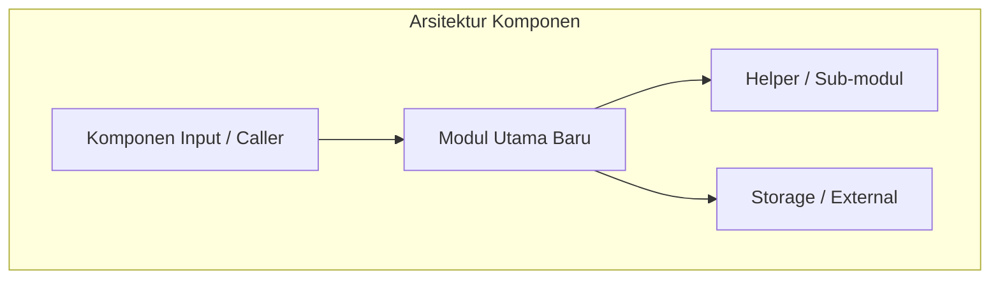

# Technical Specification & Architecture: [PROJECT_NAME_OR_ID]

> Disusun oleh: **Analis / Senior Lead Engineer (Tech Lead)**  
> Berdasarkan: `tasks/[PROJECT_ID]/01-requirements.md` (Approved)  
> Tanggal: `[YYYY-MM-DD]`

---

## 1. Audit Boilerplate & Standar Teknis Proyek Eksisting
- **Boilerplate & Struktur Repositori**:
  - Pola arsitektur dasar yang digunakan proyek: [Contoh: Clean Architecture, Layered, Monorepo, dll.]
  - Konfigurasi linter / formatter / type checker: [Contoh: ruff, flake8, mypy, eslint, tsconfig]
- **Utilitas Bersama & Modul Eksisting yang Wajib Digunakan Ulang**:
  - `path/to/existing_util.py`: [Fungsi helper / utility yang harus dimanfaatkan Coder]
  - `path/to/base_model.py`: [Base class / Interface yang harus diturunkan]
- **Konvensi Koding & Standar Teknis**:
  - Pola penamaan variabel/fungsi/kelas: [Contoh: snake_case, PascalCase, prefix/suffix khusus]
  - Standar penanganan error / Custom Exception yang sudah baku: [Contoh: AppException, Result pattern]


---

## 2. Desain Arsitektur & Komponen Baru



### Rincian Modul
- **Modul / Class A**:
  - Lokasi: `path/to/module_a.py`
  - Peran & Tanggung Jawab: [Deskripsi peran]
  - Interface / Method Utama:
    ```python
    def example_method(param1: str) -> bool:
        pass
    ```

---

## 3. Skema Data & Interface
- **Tipe Data / Data Transfer Object (DTO)**:
  ```python
  # Contoh definisi tipe data / schema
  ```
- **Error Handling & Edge Cases**:
  - Kasus 1: [Nilai kosong / invalid] -> [Respons/Exception yang diharapkan]
  - Kasus 2: [Network failure / Timeout] -> [Mekanisme fallback/retry]

---

## 4. Strategi Testing & Verifikasi Kualitas
- **Test Runner**: [Contoh: `pytest`, `unittest`, `npm test`]
- **Skenario Pengujian Wajib**:
  1. *Happy Path*: Verifikasi aliran fungsi normal.
  2. *Edge Cases*: Verifikasi input ekstrim, kosong, atau tipe salah.
  3. *Error Scenarios*: Verifikasi pesan error dan kode status sesuai.
- **Standar Lolos**: 100% test harus lolos (*Green/Pass*) sebelum diajukan review ke Analis.
