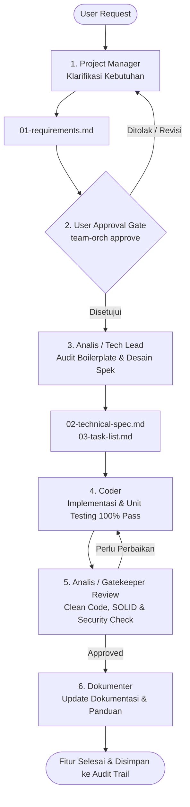

# 🚀 Autonomous Multi-Agent Engineering Framework

Framework rekayasa perangkat lunak multi-agen otonom portabel berbasis **Antigravity** dan **Herdr** multi-pane orchestration. Framework ini dirancang untuk mengorkestrasi alur kerja tim pengembang AI (Project Manager, Analis/Tech Lead, Coder, Dokumenter) dengan disiplin kode ketat, efisiensi kuota token cerdas (*adaptive model auto-switching*), audit trail transparan, dan jaminan keamanan kode (*read-only Git policy*).

---

## 📋 Daftar Isi
1. [Gambaran Umum](#-gambaran-umum)
2. [Instalasi Cepat (1-Klik Multi-Device)](#-instalasi-cepat-1-klik-multi-device)
3. [Verifikasi Instalasi](#-verifikasi-instalasi)
4. [Struktur Direktori](#-struktur-direktori)
5. [Peran Tim Agen (Roles & Responsibilities)](#-peran-tim-agen-roles--responsibilities)
6. [Aturan Baku & Standar Rekayasa (Engineering Rules)](#-aturan-baku--standar-rekayasa-engineering-rules)
7. [Panduan Penggunaan CLI (`team-orch` & `herdr-orch`)](#-panduan-penggunaan-cli-team-orch--herdr-orch)
8. [Siklus Hidup Pengembangan Fitur (Lifecycle Workflow)](#-siklus-hidup-pengembangan-fitur-lifecycle-workflow)

---

## 🌟 Gambaran Umum

Framework ini memungkinkan satu atau lebih instans AI (Antigravity IDE, `agy` CLI, atau terminal panes Herdr) bekerja sebagai satu kesatuan tim engineering profesional:
- **Zero-Friction Portability**: Siap dipasang di mesin macOS atau Linux mana pun dengan skrip instalasi 1-klik.
- **Strict Separation of Concerns (SoC)**: Membagi tugas antara PM, Tech Lead/Analis, Developer, dan Tech Writer.
- **Hemat Token 85% - 90%**: Memilih model AI secara otomatis sesuai tingkat kompleksitas pekerjaan (Flash Low, Flash High, Pro High).
- **Human-in-the-Loop Approval Gate**: Mencegah agen mengeksekusi implementasi sebelum dokumen kebutuhan disetujui secara eksplisit oleh User.
- **Audit Trail Penuh**: Mencatat setiap tindakan, eksekusi perintah, durasi, dan status keamanan ke berkas audit Markdown.

---

## ⚡ Instalasi Cepat (1-Klik Multi-Device)

Untuk memasang framework ini di perangkat baru (macOS / Linux):

```bash
# 1. Clone repositori ke komputer lokal Anda
git clone https://github.com/praharawidian-twp/agent.git agent-framework
cd agent-framework

# 2. Jalankan skrip instalasi otomatis
./installer/install.sh
```

Skrip instalasi akan secara otomatis:
- Memverifikasi prasyarat lingkungan (Python 3.8+).
- Mengonfigurasi direktori global `~/.gemini/team-orch/` (roles, templates, docs, scripts).
- Membuat symbolic link untuk CLI tools (`team-orch` dan `herdr-orch`) di `~/.local/bin/`.
- Mendaftarkan global skill `team-orchestrator` di `~/.gemini/config/skills/`.
- Mendaftarkan aturan global di `~/.gemini/GEMINI.md`.

> **Catatan PATH**: Pastikan `~/.local/bin` sudah terdaftar di variabel `$PATH` shell Anda (`~/.zshrc` atau `~/.bashrc`):
> ```bash
> export PATH="${HOME}/.local/bin:$PATH"
> ```

---

## 🔍 Verifikasi Instalasi

Setelah instalasi selesai, jalankan skrip verifikasi untuk memastikan semua komponen aktif dan berfungsi:

```bash
./installer/verify.sh
```

Output yang diharapkan:
```text
=== VERIFYING AGENT FRAMEWORK SETUP ===
[PASS] team-orch CLI: /Users/.../.local/bin/team-orch
[PASS] herdr-orch CLI: /Users/.../.local/bin/herdr-orch
[PASS] Global roles (4) & templates (5) in ~/.gemini/team-orch/
[PASS] Global skill registered
[PASS] Global rules present in ~/.gemini/GEMINI.md
========================================
[ALL CHECKS PASSED - READY FOR MULTI-DEVICE DEPLOYMENT]
```

---

## 📂 Struktur Direktori

```text
agent-portable/
├── .agents/
│   ├── docs/                     # Panduan operasional & pembuatan agen kustom
│   │   └── PANDUAN-BUAT-AGEN-KUSTOM.md
│   ├── hooks/                    # Skrip interceptor dan hook runtime
│   │   └── herdr-autoswitch.py
│   ├── hooks.json                # Konfigurasi hook Antigravity
│   ├── roles/                    # Definisi persona dan sistem prompt agen
│   │   ├── project-manager.md    # Persona Project Manager
│   │   ├── analyst.md            # Persona Senior Lead Engineer / Tech Lead
│   │   ├── coder.md              # Persona Software Developer
│   │   └── documenter.md         # Persona Technical Writer
│   ├── rules/                    # Aturan spesifik orkestrator
│   │   └── herdr-orchestration.md
│   ├── scripts/                  # Binary utilitas tim
│   │   └── team-orch             # CLI orkestrasi tim multi-agen
│   ├── skills/                   # Kumpulan custom skills (ECC, Herdr, dsb.)
│   │   ├── ecc/
│   │   ├── ecc-guide/
│   │   ├── ecc-recipes/
│   │   └── herdr-orchestrator/
│   └── templates/                # Template dokumen baku
│       ├── requirements-template.md    # Template 01-requirements.md
│       ├── technical-spec-template.md  # Template 02-technical-spec.md
│       ├── task-list-template.md       # Template 03-task-list.md
│       ├── review-log-template.md      # Template review-log.md
│       └── audit-trail-template.md     # Template audit-trail.md
├── installer/
│   ├── install.sh                # Skrip instalasi 1-klik otomatis
│   ├── verify.sh                 # Skrip verifikasi kesehatan sistem
│   └── README.md                 # Panduan cepat installer
├── AGENTS.md                     # Konfigurasi koordinasi agen workspace
├── GEMINI.md                     # Aturan baku orkestrasi & auto-switching model
├── herdr-orchestrator.py         # Engine orkestrator terminal Herdr (`herdr-orch`)
├── .gitignore                    # Berkas filter git untuk menjaga kebersihan repo
└── README.md                     # Dokumentasi utama framework
```

---

## 👥 Peran Tim Agen (Roles & Responsibilities)

| Peran (Role) | Model AI Rekomendasi | Tanggung Jawab Utama |
|---|---|---|
| **Project Manager (PM)** | `gemini-3.8-flash-high` | **Jembatan Komunikasi & Anti-Asumsi**:<br>- Berkomunikasi dengan bahasa manusia yang santun dan jelas.<br>- Bertanya balik jika instruksi pengguna ambigu sebelum merumuskan spek.<br>- Menghasilkan `01-requirements.md` dan menunggu persetujuan (User Approval Gate). |
| **Analis (Senior Lead Engineer / Tech Lead)** | `gemini-3.1-pro-high` | **Penjaga Kualitas & Arsitektur (Gatekeeper)**:<br>- Membedah boilerplate, konvensi kode, dan utilitas bersama eksisting.<br>- Menolak redundant code atau pola liar.<br>- Menyusun `02-technical-spec.md` dan `03-task-list.md`.<br>- Melakukan code review komprehensif (Clean Code, SOLID, Security, Sanitasi). Unit test hijau hanyalah syarat minimal. |
| **Coder (Developer)** | `gemini-3.8-flash-high` | **Eksekutor Fitur & Pengujian**:<br>- Menerapkan implementasi fitur modular sesuai spesifikasi teknis.<br>- Menulis unit test komprehensif dan memastikan status tes 100% *PASS*.<br>- Dilarang memodifikasi status Git (`git add`, `git commit`, `git push`). |
| **Dokumenter** | `gemini-3.8-flash-low` | **Technical Writer & Preservasi Pengetahuan**:<br>- Menyusun dokumentasi teknis, release notes, dan README.<br>- Memelihara dokumentasi arsitektur agar selalu sinkron dengan kode riil. |

---

## 🛡️ Aturan Baku & Standar Rekayasa (Engineering Rules)

### 1. Read-Only Git Discipline (PERINGATAN KERAS)
- Seluruh agen **DILARANG KERAS** menjalankan perintah pemutasi Git:
  `git add`, `git commit`, `git push`, `git merge`, `git rebase`, `git tag`, `git checkout -b`, dll.
- Perintah Git yang diizinkan hanyalah inspeksi baca saja:
  `git status`, `git diff`, `git log`, `git show`.
- Seluruh modifikasi kode tetap berada di working tree lokal. Pengguna memegang kendali penuh atas commit dan push ke repositori remote.

### 2. Adaptive Model Auto-Switching
Untuk mencegah pemborosan token dan menghindari kuota `RESOURCE_EXHAUSTED`:
- **Tingkat Rendah (Low)**: Grep, pencarian file, linting, dokumentasi, status checks $\rightarrow$ `gemini-3.8-flash-low` / `flash_lite`.
- **Tingkat Menengah (Medium)**: Fitur coding standar, unit tests, klarifikasi PM, refactoring $\rightarrow$ `gemini-3.8-flash-high` / `flash`.
- **Tingkat Tinggi (High)**: Arsitektur mendalam, review Tech Lead, audit keamanan $\rightarrow$ `gemini-3.1-pro-high` / `pro`.

### 3. Audit Trail Penuh & Transparan
- Setiap agen wajib mencatat setiap aktivitas, durasi eksekusi, perintah shell yang dijalankan, dan validasi keamanan ke berkas `tasks/<project_id>/audit-trail.md` melalui perintah `team-orch log`.
- Sebelum memulai tugas, agen wajib membaca entri log audit sebelumnya untuk mendeteksi potensi regresi atau risiko keamanan.

---

## 🛠️ Panduan Penggunaan CLI (`team-orch` & `herdr-orch`)

### CLI `team-orch`:
```bash
# 1. Menampilkan Global Mission Control Dashboard (status semua proyek dan worker)
team-orch status

# 2. Menginisialisasi proyek / fitur baru
team-orch init <project_id>

# 3. Memberikan persetujuan pada dokumen kebutuhan (Approval Gate)
team-orch approve <project_id>

# 4. Melihat riwayat audit trail proyek
team-orch audit <project_id> -n 10

# 5. Mencatat aktivitas ke audit trail
team-orch log <project_id> -r <role> -e <event> -d "<deskripsi>"

# 6. Menghasilkan instruksi prompt terstandarisasi untuk peran tertentu
team-orch prompt <role> <project_id>

# 7. Meneruskan tugas ke terminal pane Herdr tertentu
team-orch dispatch <role> <project_id> --pane <pane_id>

# 8. Mengarsipkan proyek setelah selesai
team-orch complete <project_id>
```

### CLI `herdr-orch`:
```bash
# Cek status seluruh pane di Herdr
herdr-orch status

# Periksa limit kuota pane sebelum delegasi tugas (Mandatori)
herdr-orch check-limit <pane_id>

# Klasifikasi tingkat kompleksitas prompt
herdr-orch model-recommend "<prompt>"

# Delegasikan tugas ke pane pekerja
herdr-orch delegate <pane_id> "<task_prompt>" --model <model>

# Ambil hasil keluaran dari pane pekerja
herdr-orch fetch <pane_id>
```

---

## 🔄 Siklus Hidup Pengembangan Fitur (Lifecycle Workflow)



---

## 📄 Lisensi
Framework ini dirilis di bawah lisensi MIT. Silakan adaptasi dan kembangkan sesuai kebutuhan tim engineering Anda.
